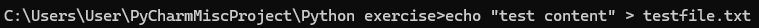
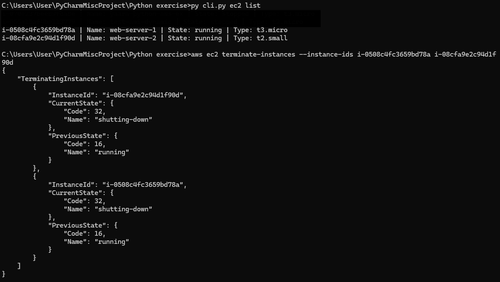
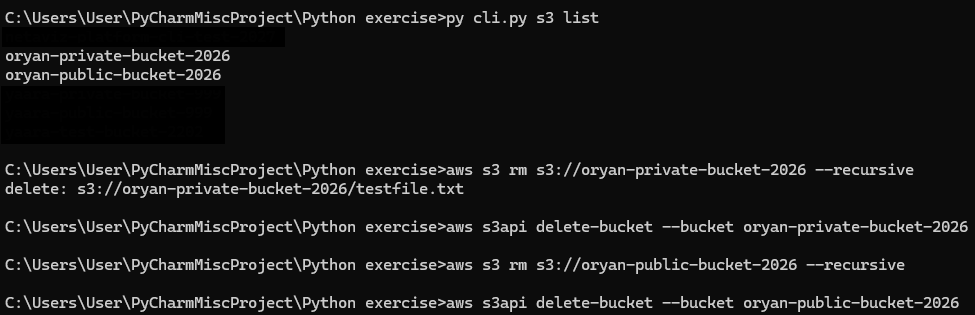
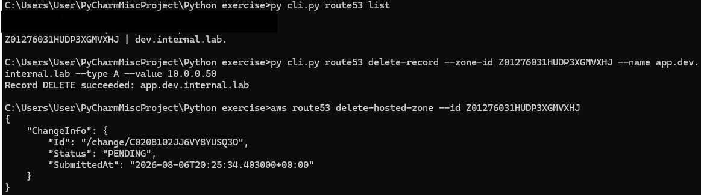

# 🚀 GuardedAgent - Zero-Trust AI Agent for AWS Infrastructure Management
Secure, natural-language CloudOps powered by Amazon Bedrock, pre-model injection scanning, and deterministic policy guardrails.
A robust Python-based Self-Service CLI tool designed for developers to provision and manage AWS resources (`EC2`, `S3`, `Route53`) within strict operational guardrails and security standards.

Built using **Python 3**, **Boto3**, and **Click**.

---

## 📋 Table of Contents
- [Overview & Architecture](#-overview--architecture)
- [Key Features & Guardrails](#-key-features--guardrails)
- [Prerequisites](#-prerequisites)
- [Installation](#-installation)
- [Tagging Specification](#-tagging-specification)
- [Usage Examples](#-usage-examples)
  - [EC2 Management](#1-ec2-instances)
  - [S3 Management](#2-s3-buckets)
  - [Route53 Management](#3-route53-dns)
- [Security Controls](#-security-controls)
- [Demo Evidence](#-demo-evidence)
- [Cleanup Guide](#-cleanup-guide)

---

## 🏗️ Overview & Architecture

The Platform CLI serves as an abstraction layer over AWS services, enabling developers to request development infrastructure independently while guaranteeing:
* **Scope Isolation**: Operations (`start`, `stop`, `upload`, `record updates`) are strictly limited to resources created by this tool.
* **Resource Optimization**: Cost-saving limits on instance counts and allowed types.
* **Compliance**: Standardized metadata tagging across all provisioned resources.

---

## 🛡️ Key Features & Guardrails

| Service | Feature | Enforced Constraint / Guardrail |
| :--- | :--- | :--- |
| **EC2** | Instance Creation | Allowed types strictly restricted to `t3.micro` or `t2.small`. |
| **EC2** | Capacity Hard Cap | Maximum **2** running/pending CLI-managed instances per account. |
| **EC2** | AMI Resolution | Auto-fetches latest stable **Ubuntu 22.04** or **Amazon Linux 2023** via SSM Parameter Store. |
| **EC2** | Management | `start`/`stop` restricted exclusively to `platform-cli` tagged instances. |
| **S3** | Bucket Creation | Defaults to private with Block Public Access enabled; public creation requires explicit confirmation. |
| **S3** | File Upload | Uploads allowed ONLY to CLI-tagged buckets. |
| **Route53**| DNS Zones & Records | Record creation/deletion strictly scoped to CLI-owned Hosted Zones. |

---

## 🔧 Prerequisites

Before running the CLI, ensure you have:
1. **Python 3.9+** installed.
2. **AWS CLI** installed and configured (`aws configure`).
3. Valid IAM credentials / Role with least-privilege permissions for EC2, S3, Route53, and SSM.

---
## 📦 Installation

1. **Clone the repository:**
   ```bash
   git clone https://github.com/EthicalNayro/platform-cli.git
   cd platform-cli
   ```
## 2. Set up a virtual environment

### Linux/Mac

```bash
python3 -m venv .venv
source .venv/bin/activate
```

### Windows

```dos
python -m venv .venv
.venv\Scripts\activate
```

---

## 3. Install dependencies

```bash
pip install -r requirements.txt[cite: 1]
```

---

# 🏷️ Tagging Specification

Every resource created by the CLI is tagged automatically to enforce governance, ownership, and policy filtering[cite: 1].

| **Tag Key** | **Example Value** | **Description** |
|--------------|-------------------|-----------------|
| `CreatedBy` | `platform-cli` | Mandatory identifier for CLI ownership validation. |
| `Owner` | `Your-Name` / `IAM-Role` | Extracted dynamically via AWS STS Caller Identity. |
| `Project` | `platform` | Project/Workload namespace. |
| `Environment` | `dev` | Target deployment environment. |
   


# 💻 Usage Examples

## 1. EC2 Instances

```bash
# Create Instance (Ubuntu by default)
python cli.py ec2 create --type t3.micro --name dev-web-server --os ubuntu

# List CLI Instances Only
python cli.py ec2 list

# Start / Stop Instance (Validates ownership tag)
python cli.py ec2 stop i-0a1b2c3d4e5f6g7h8
python cli.py ec2 start i-0a1b2c3d4e5f6g7h8
```

---

## 2. S3 Buckets

```bash
# Create Private Bucket (Default)
python cli.py s3 create --name my-company-dev-data-101

# Create Public Bucket (Prompts confirmation)
python cli.py s3 create --name my-company-public-assets-101 --public

# Upload File to CLI Bucket
python cli.py s3 upload my-company-dev-data-101 ./app-config.json

# List CLI Buckets Only
python cli.py s3 list
```

---

## 3. Route53 DNS

```bash
# Create Hosted Zone
python cli.py route53 create-zone --name dev.internal.domain

# Create / Update DNS Record (UPSERT)
python cli.py route53 create-record --zone-id Z0123456789 --name api.dev.internal.domain --type A --value 10.0.1.50

# Delete DNS Record
python cli.py route53 delete-record --zone-id Z0123456789 --name api.dev.internal.domain --type A --value 10.0.1.50

# List CLI Hosted Zones Only
python cli.py route53 list
```

---

# 🔒 Security Controls

- **Zero Hardcoded Credentials:** The CLI relies entirely on AWS SDK standard credential provider chain (IAM Roles, AWS Environment Variables, or ~/.aws/credentials).

- **Strict Parameter Enforcement:** Prevents accidental provisioning of non-allowed instance types.

- **No Unintended Destructive Actions:** Non-CLI resources are invisible and untouchable by the tool.

---

# 📸 Demo Evidence

## EC2 Operations Verification


---

## S3 Operations Verification





---

## Route53 Operations Verification


---

# 🧹 Cleanup Guide

To destroy resources created by this tool without affecting non-CLI environments, target resources tagged with `CreatedBy=platform-cli`:

## Terminate EC2 Instances

```bash
aws ec2 terminate-instances --instance-ids <INSTANCE_ID>
```


## Empty and Delete S3 Buckets

```bash
aws s3 rm s3://<BUCKET_NAME> --recursive
aws s3api delete-bucket --bucket <BUCKET_NAME>
```


## Delete Route53 Hosted Zones

```bash
aws route53 delete-hosted-zone --id <ZONE_ID>
```

