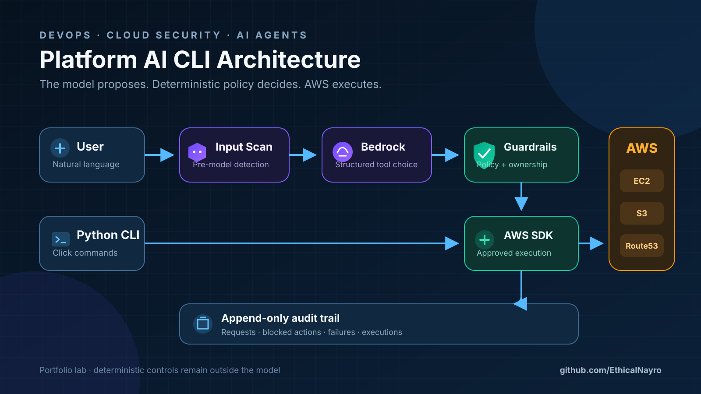
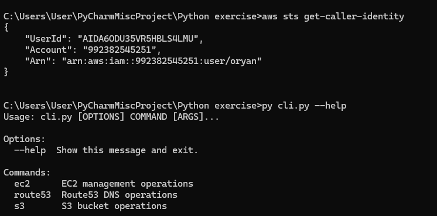
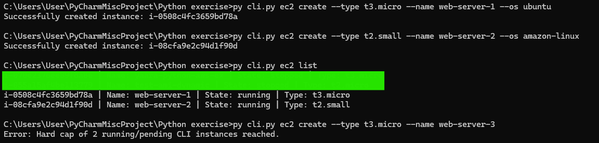
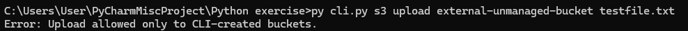
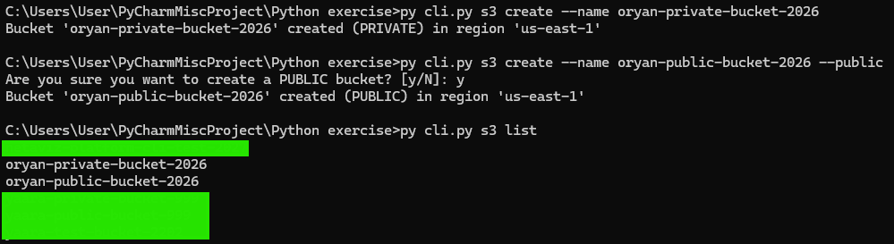
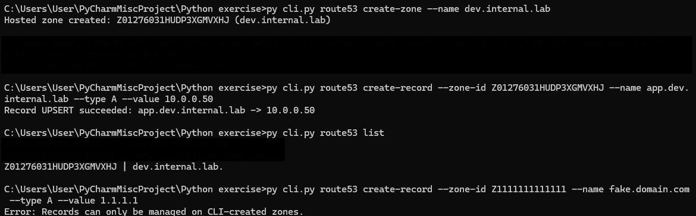

# Platform AI CLI

[](https://github.com/EthicalNayro/platform-ai-cli/actions/workflows/ci.yml)


A guarded self-service interface for managing selected AWS resources through either a conventional Python CLI or natural-language requests powered by Amazon Bedrock.

The project explores a practical question: **how can an AI agent receive real infrastructure tools without receiving permission to bypass the platform's rules?**

## Architecture



The Bedrock model selects a tool, but it never calls AWS directly. Every proposed action passes through deterministic policy checks and a resource-ownership check before execution. The same `CreatedBy=platform-cli` boundary used by the human-facing CLI also applies to the agent.

## What It Demonstrates

- **Self-service CloudOps:** manage EC2, S3, and Route53 through a Python/Click CLI.
- **Guarded agentic operations:** use Amazon Bedrock to translate natural language into supported EC2 and S3 tool calls.
- **Zero-trust agent design:** treat model output as untrusted input and validate every action before execution.
- **Resource scope isolation:** management operations are restricted to resources tagged `CreatedBy=platform-cli`.
- **Cost controls:** only `t3.micro` and `t2.small` instances are allowed, with a maximum of two non-terminated managed instances.
- **Trusted human approval:** destructive actions and S3 public-access changes require an external `--confirm` flag that is not available to the model.
- **Auditability:** requests, blocked actions, failed actions, and executed actions are written to an append-only JSONL audit log.

## Interfaces and Supported Operations

| Service | Python CLI | Bedrock Agent | Enforced policy |
|---|---:|---:|---|
| EC2 | Create, list, start, stop | Create, list, stop, terminate | Allowed types, two-instance limit, ownership tag, trusted confirmation before termination |
| S3 | Create, list, upload | Create, list | Private by default, ownership tag, trusted confirmation before changing public-access controls |
| Route53 | Create/list zones, create/delete records | Not exposed | Hosted-zone ownership tag |

## Security Flow

1. Raw user input is scanned for common prompt-injection phrases before it reaches the model.
2. Amazon Bedrock selects one of the explicitly defined tools and supplies structured arguments.
3. `guardrails.py` applies deterministic action policy and reads approval only from the external CLI flag; approval is absent from the model's tool schema.
4. `tools.py` independently rechecks confirmation, resource ownership, and operational limits at execution time.
5. The AWS SDK performs the approved operation using the standard credential provider chain.
6. The decision and result are recorded in `audit_log.jsonl`, and the model summarizes the outcome.

This layered design means a clean prompt is not automatically trusted, and a valid-looking resource ID is not automatically authorized.

## Guardrails

| Control | Enforcement point |
|---|---|
| Prompt-injection pattern scan | Before model invocation |
| EC2 instance-type allowlist | Before execution and inside the execution layer |
| Maximum two managed EC2 instances | Inside the AWS execution layer |
| `CreatedBy=platform-cli` ownership validation | Immediately before stop/terminate/upload/record operations |
| Trusted confirmation for destructive actions | External CLI flag, checked before and during execution |
| S3 Block Public Access enabled by default | During bucket creation |
| No hardcoded AWS credentials | Boto3 credential provider chain |
| Structured JSONL audit trail | At request, block, failure, and execution events |

## Quick Start

### Prerequisites

- Python 3.10+
- AWS CLI configured with an IAM identity or role
- Access to the AWS API actions listed in [`docs/iam-policy.example.json`](docs/iam-policy.example.json), narrowed for your account and environment
- Amazon Bedrock model access in `eu-west-1` for agent mode

```bash
git clone https://github.com/EthicalNayro/platform-ai-cli.git
cd platform-ai-cli

python3 -m venv .venv
source .venv/bin/activate
pip install -r requirements.txt
```

On Windows:

```powershell
python -m venv .venv
.venv\Scripts\activate
pip install -r requirements.txt
```

## CLI Examples

### EC2

```bash
python cli.py ec2 create --type t3.micro --name dev-web --os ubuntu
python cli.py ec2 list
python cli.py ec2 stop i-0123456789abcdef0
python cli.py ec2 start i-0123456789abcdef0
```

### S3

```bash
python cli.py s3 create --name unique-private-dev-bucket
python cli.py s3 upload unique-private-dev-bucket ./app-config.json
python cli.py s3 list
```

### Route53

```bash
python cli.py route53 create-zone --name dev.example.com
python cli.py route53 create-record \
  --zone-id Z0123456789 \
  --name api.dev.example.com \
  --type A \
  --value 10.0.1.50
python cli.py route53 list
```

## Agent Examples

List the configured Bedrock model tiers:

```bash
python agent.py --list-models
```

Use the default low-cost tier:

```bash
python agent.py "List the EC2 instances managed by the platform"
python agent.py "Create a private S3 bucket named my-unique-dev-bucket"
```

Choose a different model tier:

```bash
python agent.py --model balanced "Stop instance i-0123456789abcdef0"
```

Destructive and public-access-changing requests are blocked unless the human reviews the target and supplies the trusted CLI flag:

```bash
# Blocked: the model cannot approve its own destructive request
python agent.py "Terminate instance i-0123456789abcdef0"

# Approved through a separate, human-controlled channel
python agent.py --confirm "Terminate instance i-0123456789abcdef0"
```

`--confirm` is process state controlled by the caller. It is deliberately excluded from the Bedrock tool schemas, so the model cannot set or infer it.

Model availability and model IDs can vary by AWS region and account. The configured tiers are defined in `agent.py` so they can be updated without changing the policy or execution layers.

## Resource Tags

| Tag | Example | Purpose |
|---|---|---|
| `CreatedBy` | `platform-cli` | Mandatory ownership boundary |
| `Owner` | IAM caller name | Operational accountability |
| `Project` | `platform` | Workload grouping |
| `Environment` | `dev` | Environment classification |

## Validation

GitHub Actions compiles all Python modules and runs unit tests for prompt scanning, trusted confirmation boundaries, instance-type policy, tag ownership, and instance counting.

Run the same checks locally:

```bash
python -m compileall -q agent.py cli.py ec2.py s3.py route53.py guardrails.py tools.py
python -m unittest discover -s tests -v
```

## Demo Evidence

| EC2 operations | Capacity guardrail | S3 scope guardrail |
|---|---|---|
|  |  |  |

| S3 buckets | Route53 scope guardrail | Resource cleanup |
|---|---|---|
|  |  |  |

## Project Scope

This is a portfolio lab for demonstrating platform automation and guarded agent design, not a production control plane. The injection scanner is intentionally regex-based, the EC2 capacity check is not a distributed concurrency lock, and audit records are stored locally. A production implementation would add centralized immutable logs, identity-aware approvals, stronger content classification, idempotency, policy-as-code, and concurrency-safe quotas.

The included IAM policy is a transparent starter policy for the APIs used by the lab. Some AWS create/list operations require wildcard resources; production deployments should further constrain region, account, resource patterns, permission boundaries, and organizational controls.

## Repository Structure

```text
.
├── agent.py             # Bedrock conversation and tool-use loop
├── guardrails.py        # Input scanning, action policy, audit records
├── tools.py             # Bedrock schemas and guarded AWS execution
├── cli.py               # Click command entry point
├── ec2.py               # EC2 CLI operations
├── s3.py                # S3 CLI operations
├── route53.py           # Route53 CLI operations
├── tests/               # Deterministic policy tests
├── docs/                # Architecture, IAM example, and portfolio visuals
│   └── evidence/        # Original hands-on demo evidence
└── LICENSE              # MIT license
```

## License

Licensed under the [MIT License](LICENSE).
